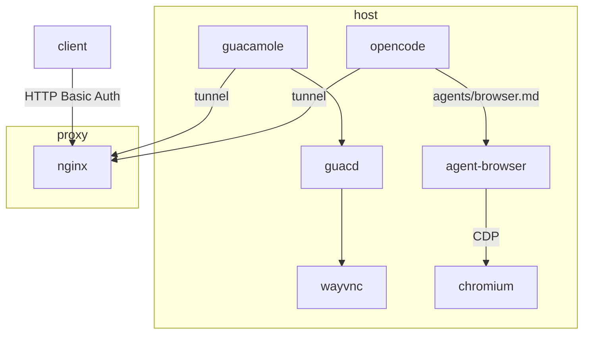

[demo video]

## Summary

This setup includes the following:

- Isolated Hyprland desktop environment with a VNC server for remote usage
- Chromium instance with CDP support
- Opencode web UI to interact with browser using `agent-browser`
- Apache Guacamole to visually see what the agent is doing, or to interact with the browser directly
- Nginx reverse proxy that exposes services over SSH tunnel

The idea is to have a browser with personal profiles saved, so an agent can interact with a browser just as a person could. It's also nice to have a remote desktop environment usable through the web to see what the agent is doing, and to pitch in if it needs help getting unstuck.

## Architecture



## Dependencies

This repository mostly serves as a reference configuration, but here is a list of the dependencies needed to recreate this setup:

- `docker`
- `hyprland`
- `agent-browser`
- `wayvnc`
- `chromium`
- `opencode`
- `nohup`

## Usage

```bash
# TUNNEL_HOST is optional
TUNNEL_HOST="root@127.0.0.1" scripts/serve
```

### Port Mapping

| Service | Port | Notes |
|---------|------|-------|
| Guacamole | 8080 | tunnel support |
| Opencode UI | 4090 | tunnel support |
| Guacd | 4222 | |
| Chromium CDP | 9222 | |
| Wayvnc | 5900 | |

### Guacamole Login

Update the login in `guacamole/user-mapping.xml` - the default login:

```
Username: admin
Password: password
```

## Security

The Nginx reference uses HTTP basic authentication with the intent to host the Opencode UI and Apache Guacamole instance on the internet. If your intent is to adopt the same configuration, be sure to enable SSL on the public server used to serve as your reverse proxy. Otherwise, the basic auth credentials will be unecrypted in traffic and anyone will have remote access to your machine exposed.

## Hyprland Workspaces

When creating a virtual monitor with Hyprland, all unused workspaces get moved to the new monitor by default. Consider pinning the workspaces you want to keep in your primary environment:

```
workspace = 1, monitor:HDMI-A-1, persistent:true
workspace = 2, monitor:HDMI-A-1, persistent:true
workspace = 3, monitor:HDMI-A-1, persistent:true
workspace = 4, monitor:HDMI-A-1, persistent:true
workspace = 5, monitor:HDMI-A-1, persistent:true
workspace = 6, monitor:HDMI-A-1, persistent:true
workspace = 7, monitor:HDMI-A-1, persistent:true
workspace = 8, monitor:HDMI-A-1, persistent:true
workspace = 9, monitor:HDMI-A-1, persistent:true
```
